# Supplier Request

App for make a request for buy an item in a company using Flask and PostgresSQL, there are 6 kind of users, the admin who can manage the users; the customer who can make requests; the chief approver, who can accept or decline in its first revision, and there are 3 kinds of financial approvers, who can accept or decline requests according to its amount.

## **How to start the app**

- Create virtual environment: `python3 -m venv venv`
- Activate virtual environment: `source venv/bin/activate`
- Install dependencies: `pip install -r requirements.txt`
- Run the app: `python3 main.py`

## UML

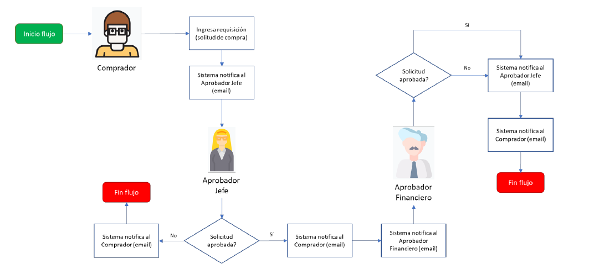

## E/R Diagram

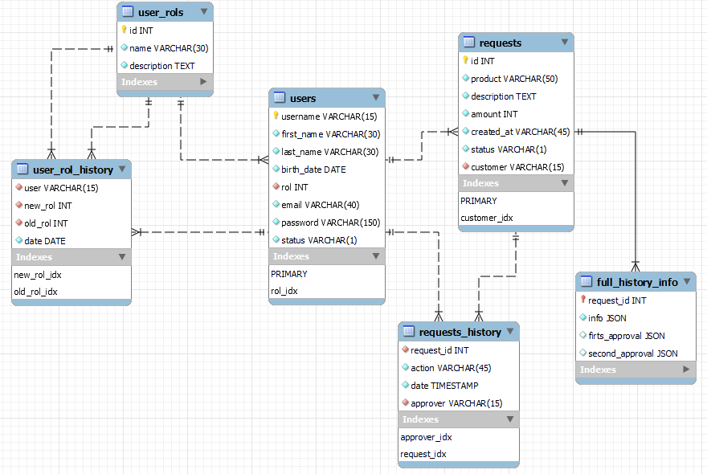

---

## Templates

---

### Register

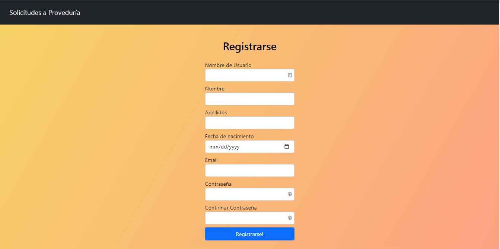

Login

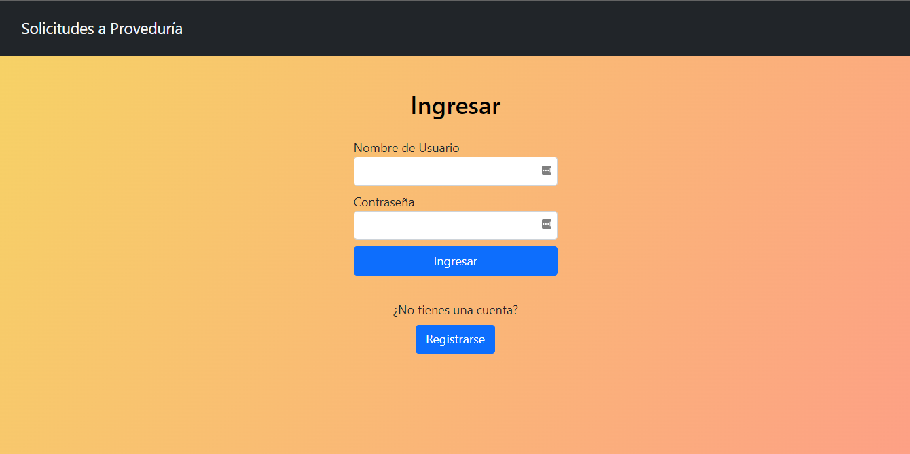

Admin Users

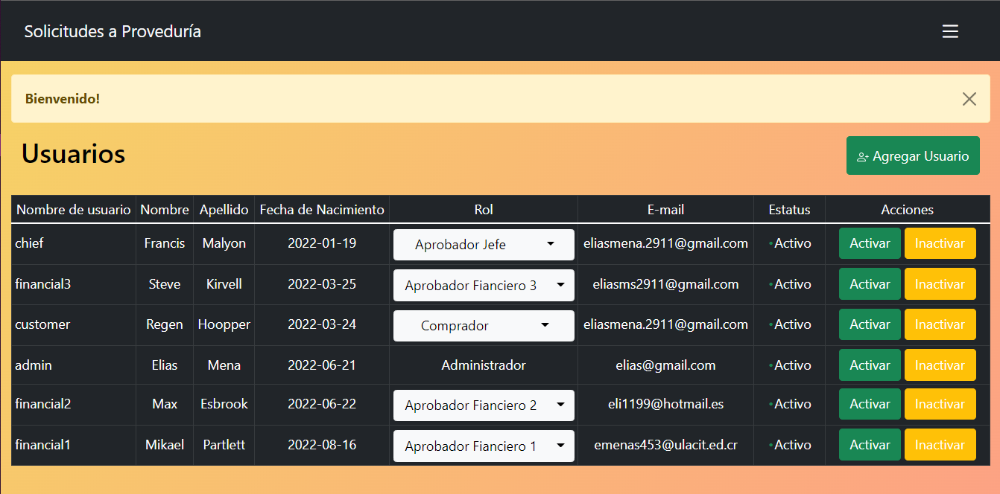

New User

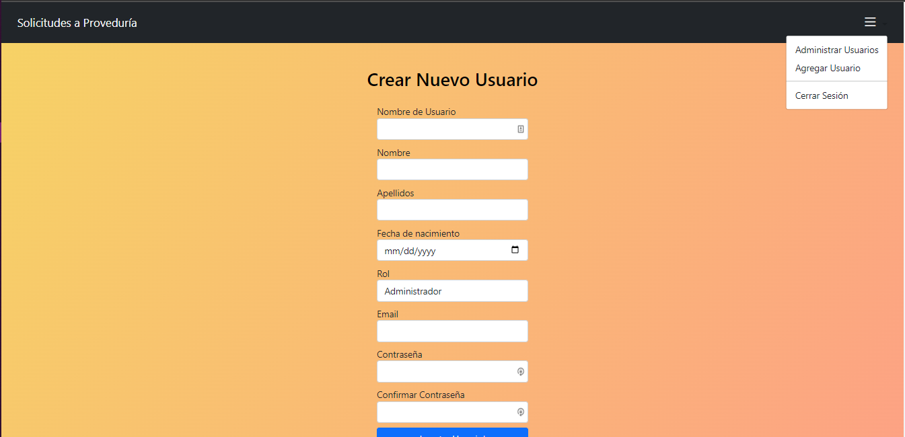

Customer Main Page

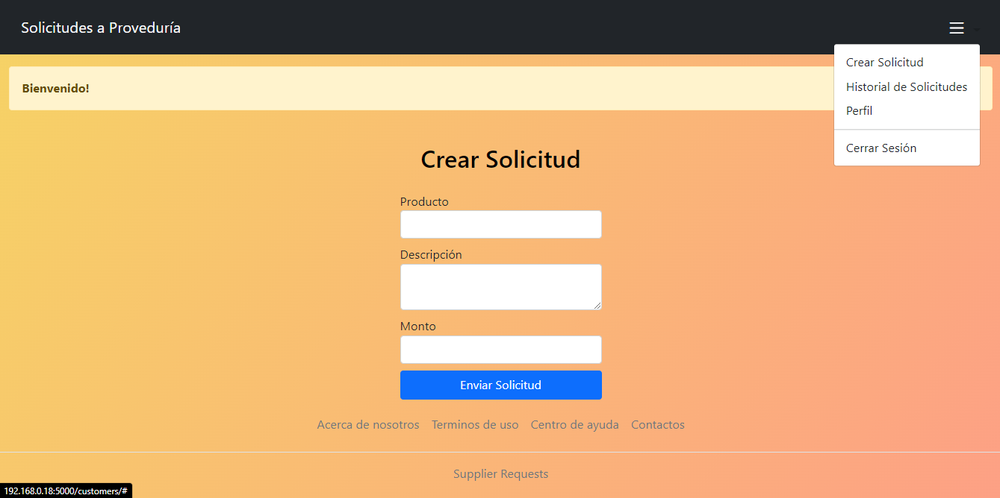

Customer requests page

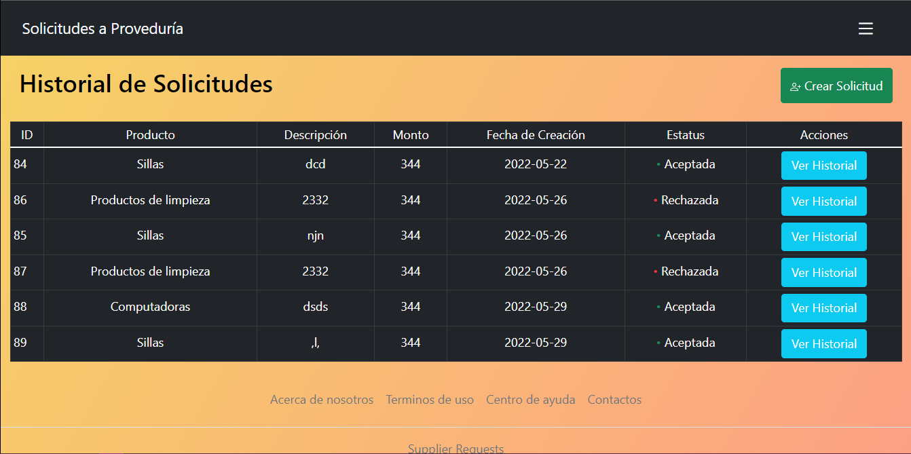

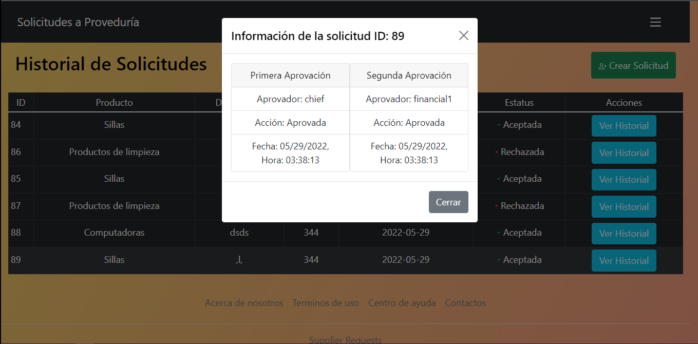

Approvers Main Page

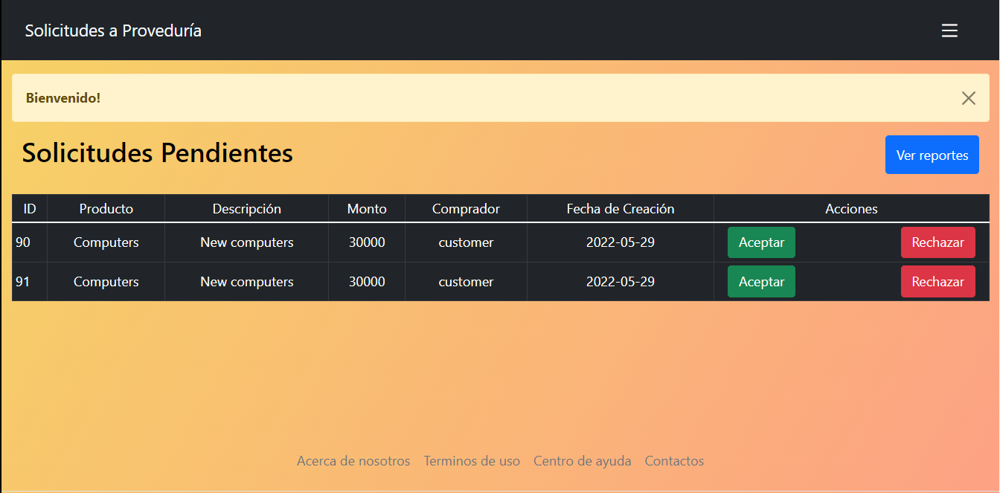

Reports Page

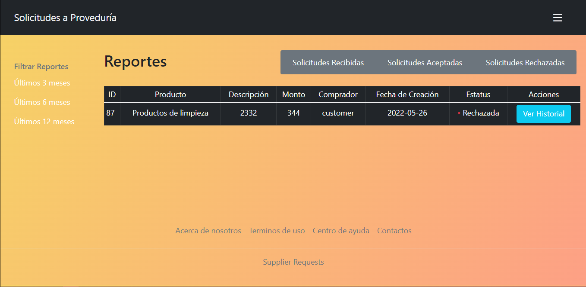